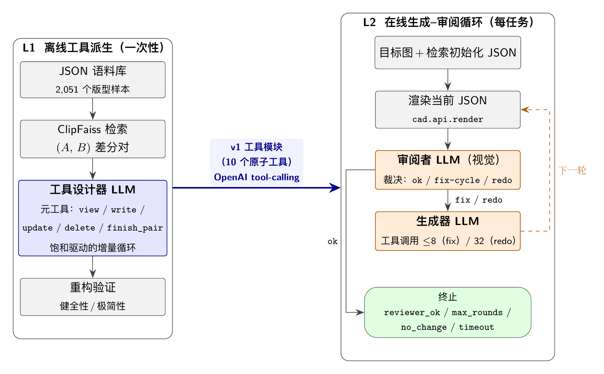

# 基于差分驱动工具派生与双智能体协作的复杂结构化 JSON 生成

本项目提出一个端到端框架，解决大语言模型在生成深度嵌套、字段间互相约束的结构化 JSON 时面临的路径幻觉、跨字段引用失效与领域工具工程成本三大痛点。框架分两层：

- **L1 离线派生**：工具设计器 LLM 以领域 JSON 语料的差分配对为输入，通过受限元工具增量演化原子编辑工具注册表，一次性产出 10 个类型化工具。
- **L2 在线循环**：生成器--审阅者双智能体通过工具调用协议挂载 L1 工具集，对检索初始化 JSON 进行多轮迭代修正。

配套构建 **GarmentBench**：整合 3 个异构来源共 2,051 个参数化服装版型样本、涵盖 7 类服装与 397 种拓扑、按结构复杂度分 4 档的评测基准。



## 主要结果

在 GarmentBench 的 100 个测试样本上（基座模型：MiMo-v2.5，25 easy / 25 medium / 25 hard / 25 very_hard）：

| 指标 | B1 (单次重写) | L2-NoTools (消融) | L2-Full (本文) |
|---|---|---|---|
| 解析成功率 | 0.900 | **1.000** | **1.000** |
| 加载成功率 | 0.850 | **0.980** | **0.980** |
| 板片均值 IoU (passed) | 0.651 | 0.665 | **0.680** |
| 缝线 F1 (passed) | 0.419 | 0.433 | **0.521** |
| 平均延迟 | **144.7 s** | 750.0 s | 605.5 s |


## Setup

### 依赖

本仓库依赖两个**外部 editable 包**，未包含在当前仓库内，但已由作者单独开源：

- `cad` — 服装版型解析、可视化与仿真接口
- `human-model` — 人体模型相关辅助库

请前往作者 GitHub 主页找到对应仓库并下载，然后通过 `uv add /path/to/cad` 与 `uv add /path/to/human-model` 以 editable 方式安装到当前环境，再执行：

```bash
uv sync
```

### 环境变量

`.env`：
```
XIOAMI-API-KEY = "<your xiaomi mimo key>"
```

默认 LLM 后端配置见 `agent/llm.py`。MiMo-v2.5 通过小米 API 接入，支持视觉理解与工具调用。

### macOS：cairo

`cad.utils.visualize` 通过 cairocffi 调系统 cairo：

```bash
brew install cairo
```

非交互 shell 需 prepend：
```bash
DYLD_FALLBACK_LIBRARY_PATH=/opt/homebrew/lib uv run python ...
```

## 运行

### L1 工具派生（离线，一次性）

```bash
uv run python utils/l1/derive.py
```

v1 工具集产出位于本地 `results/l1_derive/<timestamp>/final_tools/` 目录（运行后自动生成，不随仓库分发）。

### L2 生成--审阅循环（在线，逐样本）

```bash
# 全部测试样本
uv run python utils/eval/run_l2.py

# 指定样本（逗号分隔 sample_id）
uv run python utils/eval/run_l2.py --samples f1f6adff3f0ee88d,1289d8499ac699e9

# 批量（按难度档并行）
bash scripts/run_l2_per_bin.sh

# 无工具消融（L2-NoTools）
uv run python utils/eval/run_l2.py --no-tools
```

### B1 基线（单次全量重写）

```bash
uv run python utils/eval/run_b1.py --config config/b1_baseline_mimo.yaml
bash scripts/run_b1_per_bin.sh
```

### 评测

```bash
# 汇总 L2 运行结果
uv run python scripts/aggregate_l2_runs.py
```

### 日志可视化

```bash
uv run python log_visualizer.py logs/l2_writer   # 浏览器查看运行 log
```

## 项目结构

```
agent/
  llm.py                          LLM client（工具调用循环）
config/                            各角色 YAML 配置
  l1_designer.yaml                L1 工具设计器
  l1_transcriber.yaml             L1 转录器
  l2_writer.yaml                  L2 生成器（挂载派生工具）
  l2_writer_notools.yaml          L2 消融（无工具）
  l2_reviewer.yaml                L2 审阅者
  b1_baseline_mimo.yaml           B1 基线
prompts/                           各角色系统提示词
  l1_designer.txt                 L1 工具设计器提示词
  l1_transcriber.txt              L1 转录器提示词
  l2_writer.txt                   L2 生成器提示词
  l2_reviewer.txt                 L2 审阅者提示词
  b1_baseline.txt                 B1 基线提示词
tools/
  tools.py                        运行时工具实现
  registry.py                     工具注册表
  pattern_validator.py            JSON schema 校验
utils/
  l1/                             L1 派生流水线
    derive.py                     差分驱动派生主循环
    derive_tools.py               元工具（view/write/update/delete/finish）
    validator.py                  工具健全性验证
  l2/                             L2 双智能体循环
    loop.py                       生成器--审阅者状态机
    writer.py                     生成器（工具调用模式）
    writer_notools.py             生成器（全量重写模式，消融用）
    reviewer.py                   视觉审阅者
    render.py                     渲染辅助
  eval/
    metrics.py                    IoU / 缝线 F1 / pass_loose 评测指标
    run_b1.py                     B1 基线运行器
    run_l2.py                     L2 循环运行器
  vector_index.py                 CLIP + FAISS 图像检索
  build_split.py                  生成 train/test 切分
  build_vector_index.py           构建检索索引
scripts/                           批量运行脚本
splits/                            train/test 切分文件
vector_index/                      FAISS 索引（仅含 train，运行后生成）
```

## 数据

外部目录 `../garment_data/`：

| 来源 | 路径 | 样本数 | 板片数 | 拓扑数 |
|---|---|---|---|---|
| GCD synthetic | `gcd/garments_5000_0/` | 1,529 | 2--34 | 362 |
| Template | `template/1015/` | 500 | 2--8 | 14 |
| CLO | `clo/1015/` | 22 | 2--19 | 21 |
| **合计** | | **2,051** | 2--34 | 397 |

每个样本目录包含：
- `pattern.json` — 版型 JSON（ground truth）
- `panel_stitch.png` — 带缝线标注的二维裁片图（L2 输入）
- `panels.png` — 无缝线裁片图
- `render_front.png` — 3D 仿真正面图
- `caption.txt` — 文字描述

切分：100 test（4 档：easy / medium / hard / very_hard，92 种不重复拓扑）+ 1,951 train（兼做检索池与 L1 派生训练集）。

